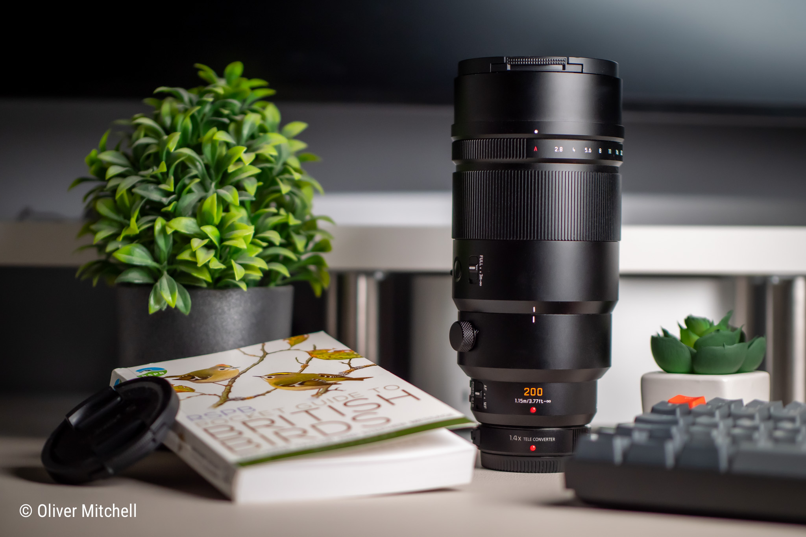

+++
date = '2025-01-01T09:33:58Z'
draft = false
title = 'Learning Photography with the Panasonic Lumix G9 Micro Four Thirds Camera'
+++

In July last year, my wife and I travelled to Japan on our three week honeymoon. Prior to the holiday I considered purchasing a mirrorless camera so that I could take better photos than my Samsung S23 smartphone could capture. Ultimately, I decided against the purchase as I wanted to pack lightly due to the number of different destinations we'd be moving between. I still managed to take some fantastic photos of Japan, but the thought of a proper camera didn't escape my mind and I ended up purchasing a mirrorless body and a couple of lenses in October.

For me, it was crucial that the camera was lightweight (ideally under a kilogram including the body and lens). I felt that the lighter and smaller the camera, the more likely I would be to easily grab it and take it with me. One of the things I was most looking forward to trying was wildlife photography, particularly birds. I currently live in rural Sussex and there are fantastic woodlands and nature reserves right on my doorstep.

The camera I purchased was a [Lumix DC-G9](https://www.panasonic.com/uk/consumer/cameras-camcorders/lumix-mirrorless-cameras/lumix-g-cameras/dc-g9.html), a mirrorless body produced by Panasonic that uses the Micro Four Thirds (MFT) system mount.

The MFT system is ideal for my needs because it's a cropped sensor (2x smaller than a full-frame camera). The key advantage is that MFT lenses can be made incredibly small and light. This makes them easier to fit in a bag and carry them around, especially if you're hiking through the countryside like me! Another advantage is that MFT lenses have a field of view that is the same as full frame lenses with twice the focal length. For example, a 200mm MFT lens has an equivalent focal length of 400mm at full frame. Combined with Panasonic's brilliant Optical Image Stabiliser (OSI), this make it possible to take steady photos at long distances without the need for a tripod; another piece of equipment you can now leave at home.

There are some disadvantages however. MFT cameras don't perform as well in low light compared to full-frame because their smaller sensor size captures less light. Therefore, to achieve the same exposure, one must raise the ISO (which introduces noise) or use a slower shutter speed (which introduces blur on moving subjects, like birds). Finally, the MFT crop factor also means they inevitably have a larger depth of field, since the aperture size is smaller. This can make it more difficult to achieve a nice blurry background and isolate a subject.

Weighing these advantages and disadvantages up is important. For me, the Lumix G9's light weight makes up for the drawbacks inherent to the MFT system. If I'm working from home, I often sling the G9 over my shoulder during a lunch break and try and capture wildlife in the woodlands near my house.

<h2 class="golden-title">Gallery</h2>
Below are some of my favourite photographs I've captured over the past three months. I'm still very new to photography and my "keeper" rate is low. When capturing birds, I struggle to line up the shot and focus quick enough before they take flight. Standing further way helps prevents them fleeing, but failing to fill the frame leads to cropping and a lower resolution image with less detail.

My hope for 2025 is that I can continue to improve and share better photos on this site.

")

<blockquote>
    

        

            ISO 800 | 280mm | f/4.0 | 1/1000s 
            Panasonic Lumix DC-G9 
            Panasonic Leica DG Elmarit 200mm f/2.8 
            Panasonic Lumix DMW-TC14 1.4x Teleconverter 
        

        

            <i>A grey squirrel (Sciurus carolinensis) standing on a lichen covered tree branch, holding a nut.</i>
        

    

</blockquote>

")

<blockquote>
    

        

            ISO 800 | 60mm | f/4.0 | 1/125s 
            Panasonic Lumix DC-G9 
            Panasonic Leica DG 12-60mm f/2.8-4.0 
        

        

            <i>A European robin (Erithacus rubecula) pirching on a tree branch.</i>
        

    

</blockquote>

")

<blockquote>
    

        

            ISO 1000 | 280mm | f/7.1 | 1/640s 
            Panasonic Lumix DC-G9 
            Panasonic Leica DG Elmarit 200mm f/2.8 
            Panasonic Lumix DMW-TC14 1.4x Teleconverter 
        

        

            <i>A grey seal (Halichoerus grypus) mother and pup resting on a sandy beach.</i>
        

    

</blockquote>
